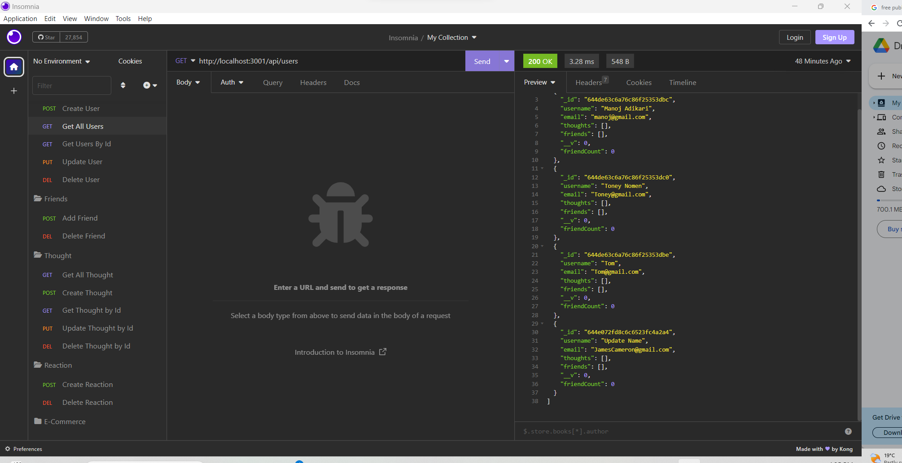
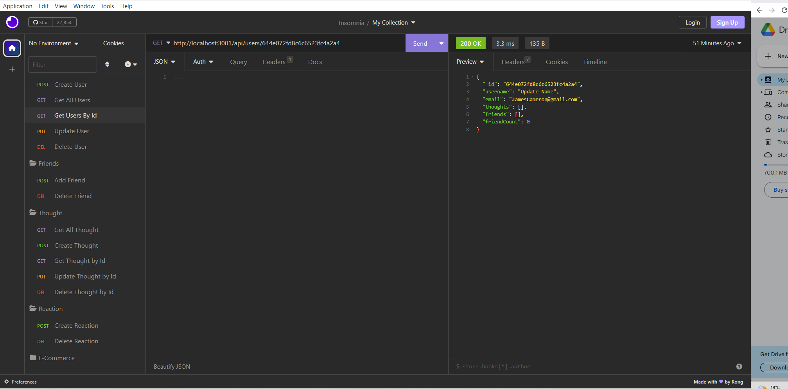
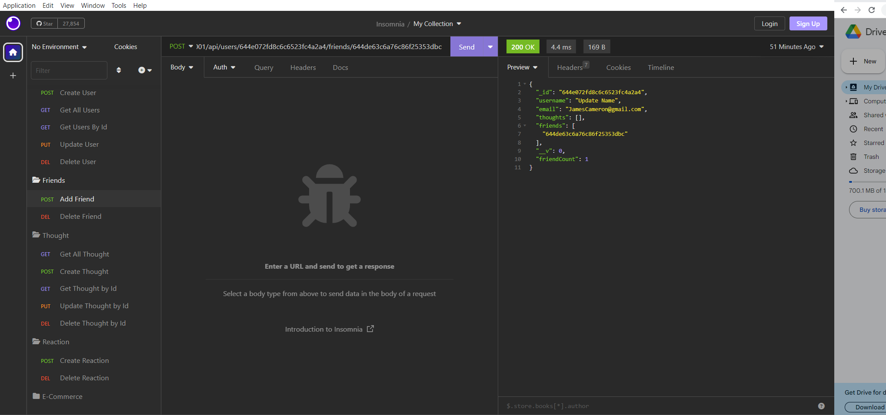
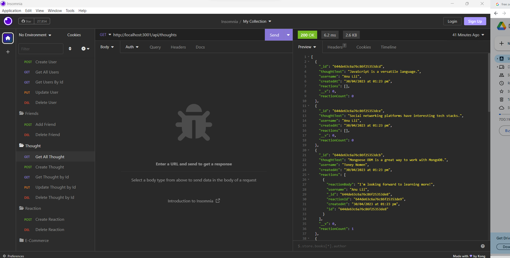

# Social Network API!


```
## Description:
MongoDB is a popular choice for many social networks due to its speed with large amounts of data and flexibility with unstructured data. Over the last part of this course, you’ll use several of the technologies that social networking platforms use in their full-stack applications. Because the foundation of these applications is data, it’s important that you understand how to build and structure the API first.Your challenge is to build an API for a social network web application where users can share their thoughts, react to friends’ thoughts, and create a friend list. You’ll use Express.js for routing, a MongoDB database, and the Mongoose ODM. In addition to using the Express.jsLinks to an external site. and MongooseLinks to an external site. packages, you may also optionally use a JavaScript date library of your choice or the native JavaScript Date object to format timestamps.Because this application won’t be deployed, you’ll also need to create a walkthrough video that demonstrates its functionality and all of the following acceptance criteria being met. You’ll need to submit a link to the video and add it to the README of your project.
```

## Table of Contents:<br />

- [Installation](#installation)<br />

- [Usage](#usage)<br />

- [Contributing](#contributing)<br />

- [Testing](#testing)<br />

- [Github](#my_github_profile)<br />

- [Licence](#license)<br />

- [Questions](#questions)<br />

## Installation:
To install the necessary dependancies please run the following command:
```
To install the necessary dependancies please run the following command: npm run start
```

## Usage:

To view this application,the following image shows the landing page of the application, or click on the page link that demonstrates the functionality of this project:\
<https://drive.google.com/file/d/1cGsK8qqH_QS9pGQq-YaeEUWvYqkNKx3h/view?usp=sharing>

All users of this application:


All thoughts of this application:


Create a new user:


Create a new thought for a user:



```
## Contributing:
```
Clone the project to your own machine useing $ git clone.Pull requests are welcome. For major changes, please open an issue first to discuss what you would like to change.
```
## Testing:

```
open server.js on integrated terminal and use command 'npm run  start'  to run the program
```


## My GitHub profile:

This is My GitHub profile; ManojAdikari
[see my GitHub profile ](https://github.com/ManojAdikari)


## License:
```
This project is licensed under; MIT_License
```

## Questions:
[Please use this this video url for more information about this application ](https://drive.google.com/file/d/1cGsK8qqH_QS9pGQq-YaeEUWvYqkNKx3h/view?usp=sharing)<br />
[see this project Repositorie ](https://github.com/ManojAdikari/Social_Network_API.git)<br />
[Clone this project](https://github.com/ManojAdikari/Social_Network_API.git) <br />
[Clone this project](git@github.com:ManojAdikari/Social_Network_API.git)<br />
If you have any questions about this project please feel free to reach  via email at [manojpadikari@gmail.com](mailto:manojpadikari@gmail.com).